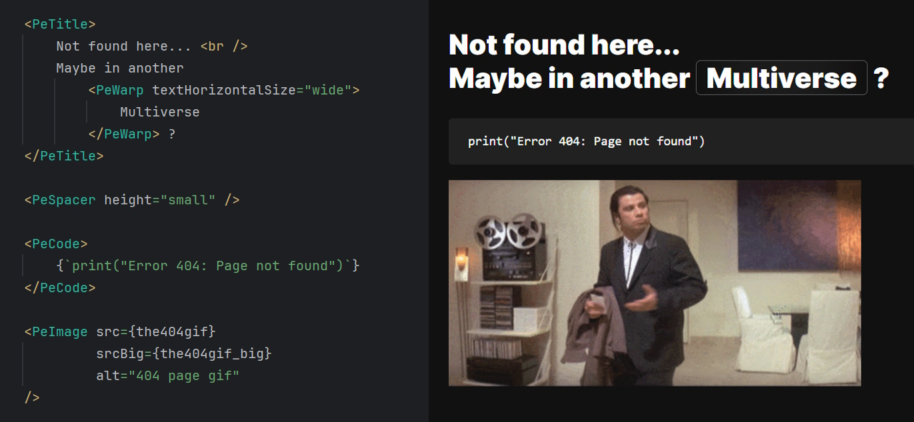

# At this time, the project is under development and not ready for use.

# EditMe Portfolio

EditPortfolio is React framework to make your own portfolio. I use it for my personal portfolio, but you can easily
fork / download && customize it to your needs (and star this repo, [buy me a coffee😊](https://buymeacoffee.com/nevolodia)).

EditPortfolio consists of custom React components and automatic page routing.




## Installation
```bash
# Clone the repository
git clone https://github.com/hackername1/PortfolioEdit.git
cd PortfolioEdit
git remote remove origin # remove the origin

# Install dependencies
npm install

# To be written...
```


## Usage overview

### General setup

In order to create your portfolio, you need to take the following steps:

1. Change following files:
	- `src/page_parts/Layout.tsx` - change the site title and pages to be displayed in the navigation bar.
	- `src/page_parts/Footer.tsx` - change the footer content.
2. Add pages to the `src/pages` directory and include them in the `src/App.tsx` file as Routes.
3. Customize the `src/styles/editme.css` file to change the global styles.
4. Customize the `public/index.html` and `public/manifest.json` files to change the favicon, title, and other properties.

Each page is a simple React component that usually consists of:
- Content as JSX in the `return` statement.
- `PePageMeta` - page meta information (title, description, keywords).

### Pe Components

[**Full component documentation.**](./docs/components.md)

The project includes various components that are specifically designed for the portfolio.
They are located in the `src/components` directory and are prefixed with `Pe` (PortfolioEdit).


## GitHub Actions CD/CI

As I use `GitHub Actions` to deploy my own portfolio to `Ubuntu Nginx` server, the project is easily configurable to
work in similar environment. You are welcome to check out the [GitHub Actions](.github/workflows/main.yml) file and
configure it to your needs.

The current deployment process is as follows:
1. Push to the `production` branch.
2. GitHub Actions build the project (with CI=false).
3. GitHub Actions deploy the project using SSH and restarts the Nginx.

Deployment uses these secrets: `HOST`, `USERNAME`, `KEY` (SSH Private Key), `SERVER_PATH` (Path to the project on the
server).


## Uses

1. React with TypeScript.
2. Bootstrap styles (only global styles without Bootstrap component styles).

